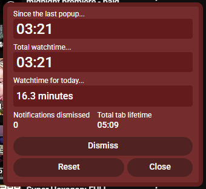

# Tab Time Notifier
Tab Time Notify is a Chrome extension for helping with watching Youtube and Twitch videos/streams for too long.

Sometimes I go to Youtube to "watch for just a few minutes", and end up losing track of time. This extension was made to better keep track of time.

# Features
- Notification popup appears every so often on selected websites to remind of time spent. Only increments when actively on the page
- Time tracker of total time spent in target webpages for the current day. Resets at 6am

# Usage
For any tab open to **certain URLs** (see manifest.json for the URLs list), a timer will be incrementing in the background while the tab is active. You can see the timer in the top right corner of the page as small text to know when it is ticking.

Once the timer reaches a threshold, a notification will appear on the page reminding you how long it has been since the last timer trigger, and how long you have been active on that particular page in total.

The idea is, if you intended to only watch for so many minutes, now might be the time to stop.

The notification can be dismissed, and it will come back after hitting the threshold again. The timer will only tick while the page is active, so actions such as listening in the background won't count.

The threshold is randomised after each trigger for variance. Currently it can be a value between **3 - 4 minutes**. See [Development Info](#development-info) for how to customise various options.

On certain sites such as youtube, changing videos won't reset the timer. So, this means it is counting your total time on youtube, not just on one particular video.

Buttons usage:

- Dismiss: dismiss the current popup, resetting the "time since last popup", but not the "total watchtime". Total watchtime is for the current open tab, while "watchtime for today" is in total (resetting at 6am).
- Reset: Resets "time since last popup" and "total watchtime" for the current tab, but not "watchtime for today"
- Close: Stops the timer for the tab completely. Need to reload page to get timer back.

# Installation
Download a release and unzip. On chrome extensions page, click "load unpacked" and select the unzipped folder.

# Development Info
[Dev Info](./doc/dev.md)